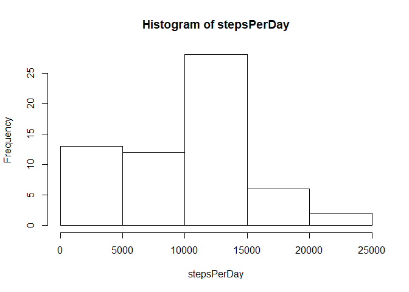
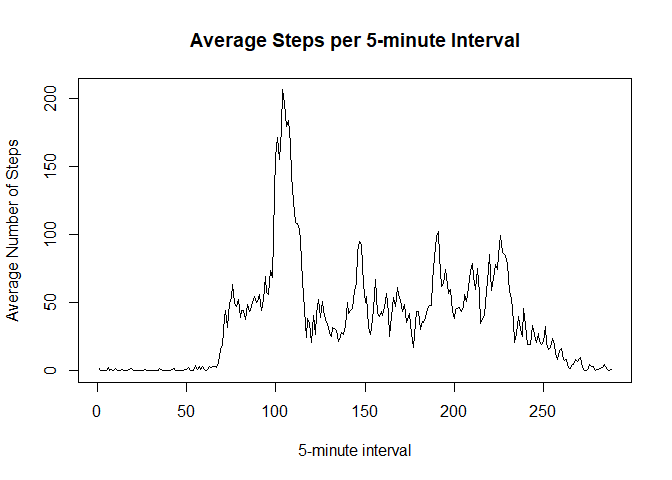
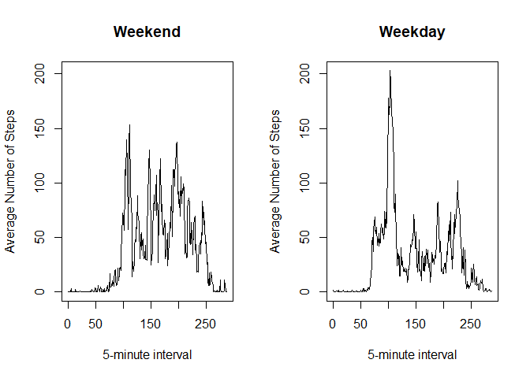

## Loading and preprocessing the data

First we load the data using read.csv(). It has 17,568 observations of 3 variables: steps, date, and interval.


```r
activity <- read.csv("activity/activity.csv")
```

Now that we have the data, we can process/transform it into a format suitable for analysis. To do this, I'd like to do is turn the dates into Date objects, and the intervals into factors.


```r
activity[,2] <- as.Date(activity[,2], format="%Y-%m-%d")
activity[,3] <- as.factor(activity[,3])
```

## What is mean total number of steps taken per day?

To answer this question, first I will find the total number of steps taken per day.


```r
stepsPerDay <- tapply(activity[,1], activity[,2], sum, na.rm = TRUE)
stepsPerDay
```

```
## 2012-10-01 2012-10-02 2012-10-03 2012-10-04 2012-10-05 2012-10-06 
##          0        126      11352      12116      13294      15420 
## 2012-10-07 2012-10-08 2012-10-09 2012-10-10 2012-10-11 2012-10-12 
##      11015          0      12811       9900      10304      17382 
## 2012-10-13 2012-10-14 2012-10-15 2012-10-16 2012-10-17 2012-10-18 
##      12426      15098      10139      15084      13452      10056 
## 2012-10-19 2012-10-20 2012-10-21 2012-10-22 2012-10-23 2012-10-24 
##      11829      10395       8821      13460       8918       8355 
## 2012-10-25 2012-10-26 2012-10-27 2012-10-28 2012-10-29 2012-10-30 
##       2492       6778      10119      11458       5018       9819 
## 2012-10-31 2012-11-01 2012-11-02 2012-11-03 2012-11-04 2012-11-05 
##      15414          0      10600      10571          0      10439 
## 2012-11-06 2012-11-07 2012-11-08 2012-11-09 2012-11-10 2012-11-11 
##       8334      12883       3219          0          0      12608 
## 2012-11-12 2012-11-13 2012-11-14 2012-11-15 2012-11-16 2012-11-17 
##      10765       7336          0         41       5441      14339 
## 2012-11-18 2012-11-19 2012-11-20 2012-11-21 2012-11-22 2012-11-23 
##      15110       8841       4472      12787      20427      21194 
## 2012-11-24 2012-11-25 2012-11-26 2012-11-27 2012-11-28 2012-11-29 
##      14478      11834      11162      13646      10183       7047 
## 2012-11-30 
##          0
```

Then I will make a histogram of the total number of steps taken per day.


```r
hist(stepsPerDay)
```

<!-- -->

Finally, I will calculate the mean and median of the total number of steps taken per day.


```r
mean(stepsPerDay)
```

```
## [1] 9354.23
```

```r
median(stepsPerDay)
```

```
## [1] 10395
```

## What is the average daily activity pattern?

Let's make a time series plot (i.e. type = "l") of the 5-minute interval (x-axis) and the average number of steps taken, averaged across all days (y-axis).


```r
avgStepsPerInterval <- tapply(activity[,1], activity[,3], mean, na.rm = TRUE)
plot(avgStepsPerInterval, type = "l", xlab="5-minute interval", ylab="Average Number of Steps", main="Average Steps per 5-minute Interval")
```

<!-- -->

Which 5-minute interval, on average across all the days in the dataset, contains the maximum number of steps?


```r
maxSteps <- max(avgStepsPerInterval)
which(avgStepsPerInterval == maxSteps)
```

```
## 835 
## 104
```

So, the 104th time interval (that is not entirely NA) which corresponds to the interval 835-840 minutes in the day.

## Imputing missing values

To understand the missing data, we can calculate and report the total number of missing values in the dataset (i.e. the total number of rows with NAs)


```r
sum(is.na(activity[,1]))
```

```
## [1] 2304
```

Now to devise a strategy for filling in all of the missing values in the dataset. I think I'll use average number of steps for that day, truncated to an integer.


```r
fillNA <- function(day){
    daySteps <- activity[activity$date==day,1]
    dayMean <- as.integer(mean(daySteps, na.rm = TRUE))
    if(is.na(dayMean)){
        dayMean <- 0
    }
    return(dayMean)
}
```

Create a new dataset that is equal to the original dataset but with the missing data filled in. I'll sum the NAs again to show you that they have all been replaced.


```r
for(i in seq_along(activity[,1])){
    if(is.na(activity[i,1])){
        activity[i,1] <- fillNA(activity[i,2])
    }
}
sum(is.na(activity[,1]))
```

```
## [1] 0
```

Make a histogram of the total number of steps taken each day and Calculate and report the mean and median total number of steps taken per day. 


```r
stepsPerDay <- tapply(activity[,1], activity[,2], sum, na.rm = TRUE)
hist(stepsPerDay)
```

<!-- -->

```r
mean(stepsPerDay)
```

```
## [1] 9354.23
```

```r
median(stepsPerDay)
```

```
## [1] 10395
```

## Are there differences in activity patterns between weekdays and weekends?

Create a new factor variable in the dataset with two levels - "Weekday" and "Weekend" indicating whether a given date is a weekday or weekend day.


```r
activity$fun <- weekdays(activity$date)
for(i in seq_along(activity$fun)){
    if(activity[i,4] == "Saturday" || activity[i,4] == "Sunday"){
        activity[i,4] <- "Weekend"
    }
    else{
        activity[i,4] <- "Weekday"
    }
}
activity$fun <- as.factor(activity$fun)
summary(activity)
```

```
##      steps             date               interval          fun       
##  Min.   :  0.00   Min.   :2012-10-01   0      :   61   Weekday:12960  
##  1st Qu.:  0.00   1st Qu.:2012-10-16   5      :   61   Weekend: 4608  
##  Median :  0.00   Median :2012-10-31   10     :   61                  
##  Mean   : 32.48   Mean   :2012-10-31   15     :   61                  
##  3rd Qu.:  0.00   3rd Qu.:2012-11-15   20     :   61                  
##  Max.   :806.00   Max.   :2012-11-30   25     :   61                  
##                                        (Other):17202
```

Make a panel plot containing a time series plot (i.e. type = "l") of the 5-minute interval (x-axis) and the average number of steps taken, averaged across all weekday days or weekend days (y-axis). 


```r
weekendActivity <- activity[activity$fun == "Weekend",1:3]
weekdayActivity <- activity[activity$fun == "Weekday",1:3]

avgWeekendStepsPerInterval <- tapply(weekendActivity[,1], weekendActivity[,3], mean)
avgWeekdayStepsPerInterval <- tapply(weekdayActivity[,1], weekdayActivity[,3], mean)

rng <- range(avgWeekendStepsPerInterval, avgWeekdayStepsPerInterval)
par(mfrow = c(1,2))

plot(avgWeekendStepsPerInterval, type = "l", ylim = rng, xlab="5-minute interval", ylab="Average Number of Steps", main="Weekend")
plot(avgWeekdayStepsPerInterval, type = "l", ylim = rng, xlab="5-minute interval", ylab="Average Number of Steps", main="Weekday")
```

<!-- -->
